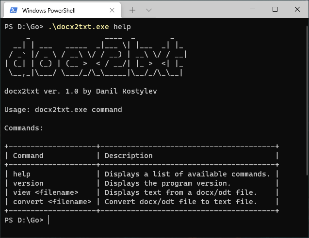

# docx2txt

Console tool for converting and viewing `.docx` (Microsoft Word) or `.odt` (OpenDocument Format) files.

The tool is currently only available for Windows. You can make builds for Mac/Linux yourself.



## Commands

Command | Description
--- | ---
`help` | Displays a list of available commands.
`version` | Displays the program version.
`view <filename>` | Displays text from a docx/odt file.
`convert <filename>` | Convert docx/odt file to text file.

## How to Use

You can get `.exe` from [Releases](https://github.com/kstlv/docx2txt/releases/latest).

### Usage examples

You can only use the first letter for commands: `help`, `view`, `convert`.

View text from "document.docx":

```powershell
.\docx2txt.exe view .\document.docx
```

Convert "notes.odt" to text file:

```powershell
.\docx2txt.exe convert .\notes.odt
```

Display help:

```powershell
.\docx2txt.exe h
```

## How to Build

1. Download and install [golang](https://go.dev/).
2. Go to the source folder and `go build -ldflags "-s -w"`.

Golang environment settings `go env` affect the build command. In the environment settings, you can define the architecture and OS.

## Issues

- Special characters and lowercase Cyrillic letters were lost after a "convert" or "view" operation was performed on files with the `.odt` extension. Files with the `.docx` extension do not have this problem.

## License

See file [LICENSE](./LICENSE).
